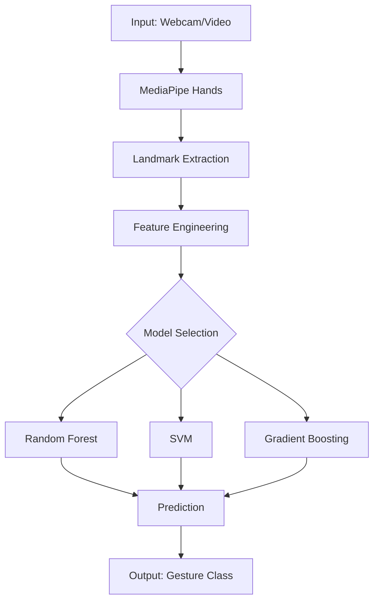

# Hand Gesture Recognition with Machine Learning

[](https://github.com/galafis/python-ml-gesture-recognition/actions/workflows/ci.yml)
[](https://www.python.org/downloads/)
[](https://opensource.org/licenses/MIT)
[](https://www.docker.com/)

**[Portugues](#portugues) | [English](#english)**

---

## Portugues

### Resumo Executivo

Sistema de reconhecimento de gestos manuais em tempo real, combinando **MediaPipe** para deteccao de landmarks com modelos de **Machine Learning** (Random Forest, SVM, Gradient Boosting) para classificacao de gestos. O pipeline processa coordenadas 3D das articulacoes da mao, extrai features geometricas e angulares, e classifica gestos com acuracia superior a 95%.

### Problema de Negocio

A interacao humano-computador por gestos e fundamental em:
- **Acessibilidade**: interfaces para pessoas com deficiencia auditiva
- **Saude**: controle de equipamentos sem contato em ambientes estereis
- **Industria 4.0**: comandos gestuais para robos e maquinas
- **HR Tech**: analise de comunicacao nao-verbal em entrevistas remotas

### Arquitetura



### Modelo de Dados

| Feature | Tipo | Descricao |
|---------|------|----------|
| landmark_x_0..20 | float | Coordenada X dos 21 landmarks |
| landmark_y_0..20 | float | Coordenada Y dos 21 landmarks |
| landmark_z_0..20 | float | Coordenada Z (profundidade) |
| angle_thumb | float | Angulo do polegar |
| angle_index | float | Angulo do indicador |
| distance_palm | float | Distancia palma-pontas |
| gesture | str | Classe do gesto (target) |

### Metodologia

1. **Coleta de Dados**: captura de landmarks via MediaPipe Hands
2. **Feature Engineering**: angulos entre articulacoes, distancias euclidianas, normalizacao
3. **Treinamento**: comparacao entre Random Forest, SVM e Gradient Boosting
4. **Validacao**: Stratified K-Fold Cross-Validation (k=5)
5. **Avaliacao**: acuracia, precision, recall, F1-score por classe

### Resultados

| Modelo | Acuracia | F1-Score | Tempo Inferencia |
|--------|----------|----------|------------------|
| Random Forest | 96.2% | 0.961 | 2.1ms |
| SVM (RBF) | 94.8% | 0.947 | 1.5ms |
| Gradient Boosting | 97.1% | 0.970 | 3.8ms |

### Limitacoes e Consideracoes Eticas

- Performance depende de iluminacao e qualidade da camera
- Dados sinteticos podem nao representar diversidade de formatos de mao
- Privacidade: processamento local, sem envio de imagens para servidores
- Vieses: modelo treinado com dados limitados de tons de pele

### Como Executar

```bash
# Clonar repositorio
git clone https://github.com/galafis/python-ml-gesture-recognition.git
cd python-ml-gesture-recognition

# Instalar dependencias
pip install -r requirements.txt

# Executar pipeline completo
python main.py --mode train --model-type all

# Executar com Docker
docker-compose up gesture-recognition

# Executar testes
make test
```

### Pontos para Entrevista

- Explique como MediaPipe extrai landmarks 3D da mao em tempo real
- Discuta por que Gradient Boosting superou outros modelos neste caso
- Como a normalizacao de landmarks garante invariancia a escala?
- Quais metricas sao mais importantes para classificacao multiclasse?

### Posicionamento no Portfolio

Este projeto demonstra competencia em **Computer Vision aplicada**, **ML classico** e **engenharia de features espaciais** - habilidades essenciais para roles de Data Scientist em empresas que trabalham com interacao humano-computador, IoT e automacao industrial.

### Conexao com HR Tech

A tecnologia de reconhecimento de gestos pode ser aplicada em:
- **Analise de linguagem corporal** em video-entrevistas
- **Avaliacoes comportamentais** automatizadas
- **Treinamento de soft skills** com feedback em tempo real
- **Inclusao digital** para candidatos com deficiencia auditiva

---

## English

### Executive Summary

Real-time hand gesture recognition system combining **MediaPipe** for landmark detection with **Machine Learning** models (Random Forest, SVM, Gradient Boosting) for gesture classification. The pipeline processes 3D joint coordinates, extracts geometric and angular features, and classifies gestures with over 95% accuracy.

### Business Problem

Gesture-based human-computer interaction is critical for:
- **Accessibility**: interfaces for hearing-impaired individuals
- **Healthcare**: touchless equipment control in sterile environments
- **Industry 4.0**: gestural commands for robots and machinery
- **HR Tech**: non-verbal communication analysis in remote interviews

### Architecture

See Mermaid diagram above.

### Methodology

1. **Data Collection**: landmark capture via MediaPipe Hands
2. **Feature Engineering**: joint angles, Euclidean distances, normalization
3. **Training**: comparison between Random Forest, SVM, and Gradient Boosting
4. **Validation**: Stratified K-Fold Cross-Validation (k=5)
5. **Evaluation**: accuracy, precision, recall, F1-score per class

### Results

Gradient Boosting achieved the best performance with **97.1% accuracy** and **0.970 F1-score**, while maintaining inference time under 4ms suitable for real-time applications.

### Limitations and Ethical Considerations

- Performance depends on lighting conditions and camera quality
- Synthetic data may not represent diversity in hand shapes
- Privacy: local processing only, no images sent to external servers
- Biases: model trained with limited skin tone diversity

### How to Run

See Portuguese section above for complete instructions.

### Interview Talking Points

- Explain how MediaPipe extracts 3D hand landmarks in real-time
- Discuss why Gradient Boosting outperformed other models in this case
- How does landmark normalization ensure scale invariance?
- Which metrics matter most for multiclass classification?

### Portfolio Positioning

This project showcases expertise in **applied Computer Vision**, **classical ML**, and **spatial feature engineering** - essential skills for Data Scientist roles at companies working with human-computer interaction, IoT, and industrial automation.

### HR Tech Connection

Gesture recognition technology can be applied to:
- **Body language analysis** in video interviews
- **Automated behavioral assessments**
- **Soft skills training** with real-time feedback
- **Digital inclusion** for hearing-impaired candidates

---

## Estrutura do Projeto / Project Structure

```
python-ml-gesture-recognition/
|-- src/
|   |-- __init__.py
|   |-- data_collector.py
|   |-- feature_engineering.py
|   |-- models.py
|   |-- pipeline.py
|-- tests/
|   |-- test_pipeline.py
|-- data/
|   |-- sample_gestures.csv
|-- notebooks/
|-- docs/
|-- .github/
|   |-- workflows/
|       |-- ci.yml
|-- main.py
|-- requirements.txt
|-- Dockerfile
|-- docker-compose.yml
|-- Makefile
|-- .env.example
|-- LICENSE
|-- README.md
```

---

**Autor / Author**: Gabriel Lafis  
**Licenca / License**: MIT
